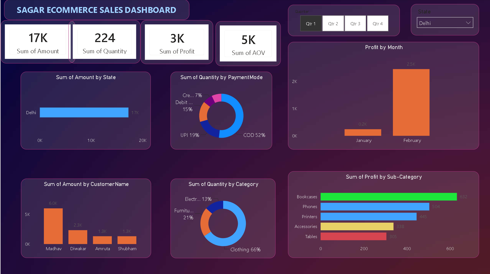

# Sagar E-Commerce Sales Dashboard | Power BI

An interactive E-Commerce Sales Dashboard created using Microsoft Power BI to analyze sales performance, quantity, profit, customers, payment modes, categories, and sub-categories.

## 📊 Dashboard Features

- KPI cards for Amount, Quantity, Profit and AOV
- State-wise sales analysis
- Payment mode analysis
- Monthly profit analysis
- Customer-wise sales analysis
- Category-wise quantity analysis
- Sub-category-wise profit analysis
- Interactive Quarter filter
- Interactive State filter

## 🛠️ Tech Stack

- Microsoft Power BI
- Power Query
- DAX
- Data Visualization
- Data Analysis

## 📈 Key Visualizations

- Bar Charts
- Donut Charts
- Column Charts
- KPI Cards
- Slicers
- Interactive Filters

## 📷 Dashboard Preview

## 📁 Project Files

- `Sagar Ecommerce Sales Dashboard.pbix` — Power BI dashboard file
- `dashboard.png` — Dashboard preview

## 🎯 Objective

The objective of this project was to build an interactive dashboard that helps analyze e-commerce sales data and identify trends across states, customers, payment methods, categories, and sub-categories.

## 👨‍💻 Author

**Satyam Kumar Kewot**

B.Tech CSE | Data Analytics & Full Stack Development
